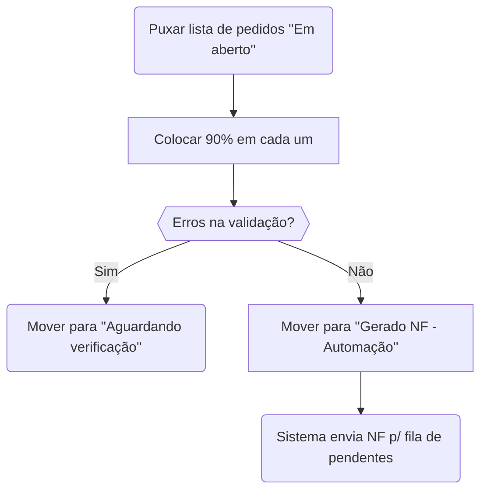
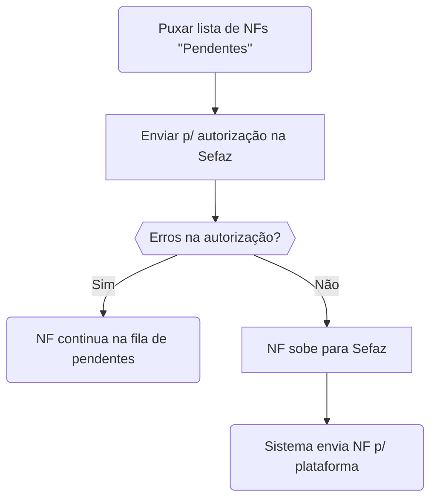

A preparação e emissão de NFes na Global é feita quase inteiramente pela automação nas contas **Mundial Alumínios** e **Imperium Alumínios** e dividido em duas partes, de acordo com o seguinte fluxograma:
### Preparação de NFes (automação)

!!! tip "Dica"
	Quando falamos em "Mover para *X*", estamos falando de diferentes situações existentes no sistema do Bling. Essas situações são a maneira que acompanhamos os pedidos no sistema e o que vai acontecendo com eles. São fases importantes e devem ser acompanhadas pelo colaborador responsável pelo faturamento. Entenda mais em [Situações dos pedido de venda – Bling!](https://ajuda.bling.com.br/hc/pt-br/articles/360036457114-Situa%C3%A7%C3%B5es-dos-pedido-de-venda)
	
O processo de colocar 90% nos pedidos é necessário para garantir compliance com as regras de faturamento da empresa e todo pedido dentro das lojas *Shein* e *Shopee* devem ser modificados e faturados de acordo com essa condição.
Após a automação fazer esse processo, ele parte para o faturamento de facto das NFs. Isso também é automático.

### Faturamento

Quando uma NF sobe para a Sefaz, na maioria dos casos, ele já envia os dados dela para a plataforma fazer a validação, de modo que a etiqueta de envio do pedido já estará disponível no **[canal de origem](/glossario/o-que-e-canal-de-origem)**.

Você pode acompanhar o trabalho da automação no seguinte repositório privado do Github: [Workflow runs · gbrnasc/Script-90off (github.com)](https://github.com/gbrnasc/Script-90off/actions)  
Lembrando que é necessário pedir autorização e ter uma conta no Github para poder acompanhar.

**Nessa parte do processo, são necessárias as verificações para policiar o trabalho da automação.** Como já foi explicado nos fluxogramas acima, ela não é perfeita e caso haja quaisquer erros na validação do pedido ou na autorização da NF, a automação jogará o pedido para uma fila de pendências. É importante que o colaborador responsável verifique essa fila, seguindo algumas regras e soluções básicas importantes:
## Verificação de pendências - Pedidos
### Para pedidos em "Aguardando verificação"
=== "NF já foi gerada"
    Para pedidos que a NF já foi gerada e já está integrada na plataforma (símbolo de </img> no pedido) você pode mover direto para a situação ":fontawesome-solid-circle:{.atendido} Atendido", com a anotação "NF já gerada"
=== "NF ainda não foi gerada"
    Para pedidos em que a NF não foi nem sequer gerada, você pode reintegrar o pedido movendo ele para a situação ":fontawesome-solid-circle:{.aberto} Em aberto" com a anotação "Reintegrando"

    Você consegue saber se a NF for gerada se o pedido não tiver nem o símbolo de dólar </img> e nem o símbolo de NF </img>.

## Verificação de pendências - NF
Para as NFs que estão na situação "Pendentes", há algumas verificações que podem ser feitas:
???+ warning "Como descobrir o erro da NF?"
    Você deve seguir o seguinte procedimento para verificar qual é o erro da nota:  
        1. Clique na nota fiscal  
        2. Clique em 'Salvar'  
    Esse procedimento é necessário para buscar o erro desta nota.

=== "Faltando bairro"
    Para as NFs que estejam faltando o bairro, você pode solucionar colocando "Centro" no contato, de acordo com o guia abaixo:
    
    
=== "Faltando NCM"
=== "Faltando origem"
=== "Consultar situação"
