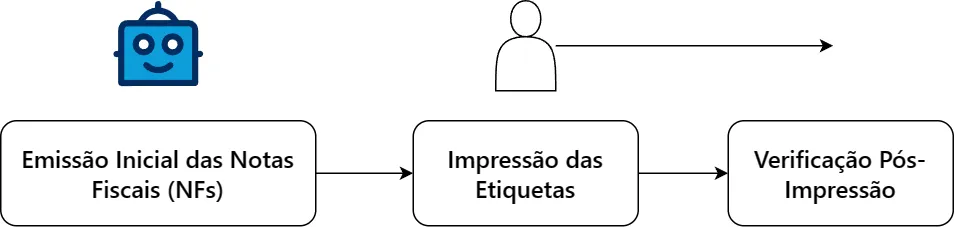

# Guia de Impressão de Etiquetas e Expedição

Bem-vindo ao Guia de Impressão de Etiquetas e Expedição da Global Alumínios! Este guia foi desenvolvido para fornecer diretrizes abrangentes e práticas para o processo de impressão de etiquetas e expedição de produtos em nossa empresa.

## Sobre a Global Alumínios

Somos uma empresa líder na fabricação de utensílios domésticos de alta qualidade, atendendo a diversos setores com excelência e compromisso com a satisfação do cliente. 

## Objetivo do Guia

O objetivo deste guia é proporcionar uma visão detalhada dos procedimentos e práticas recomendadas para a impressão de etiquetas e a eficiente organização da expedição dos nossos produtos. 

## Público-Alvo

Destinado aos colaboradores envolvidos no processo de impressão de etiquetas e expedição, este guia visa facilitar e padronizar nossas operações, garantindo qualidade e agilidade em nossos serviços.

Estamos comprometidos com a excelência operacional e aprimoramento contínuo. Vamos juntos otimizar nossos processos!

## Processo de Impressão de Etiquetas

!!! info "Aviso útil"

    As informações contidas nesse processo estão sujeitas à serem modificadas. Esse projeto é um constante trabalho em progresso.

O processo de impressão de etiquetas na Global Alumínios é dividido em três fases distintas, cada uma desempenhando um papel crucial na qualidade e precisão das etiquetas utilizadas na expedição dos nossos produtos.

### [1. Emissão Inicial das Notas Fiscais (NFs)](/emissao)

A primeira fase inicia-se com a emissão inicial das Notas Fiscais. Nesta etapa, os dados referentes aos produtos a serem expedidos são registrados e compilados para a geração das etiquetas. Essa fase é representada pela emissão das NFs pela automação.

### 2. Impressão das Etiquetas

Na segunda fase, ocorre a impressão das etiquetas de facto. Essa parte é muito importante e envolve as plataformas de marketplaces, o ERP, planilhas, e outras ferramentas que são úteis para

### 3. Verificação Pós-Impressão

Após a impressão, a etapa de verificação pós-impressão entra em cena. Aqui, as etiquetas são minuciosamente examinadas para assegurar a conformidade com os padrões de qualidade estabelecidos. Qualquer discrepância identificada é corrigida antes da etiquetagem dos produtos.

---

## Diagrama do Processo de Impressão de Etiquetas

A seguir, apresentamos um diagrama que ilustra o fluxo do processo de impressão de etiquetas na Global Alumínios:

Este diagrama visualiza de forma simplificada as três fases do processo, destacando a sequência de atividades e interações entre elas.

Escolha [qualquer uma das sessões acima](#processo-de-impressao-de-etiquetas) para continuar no guia.

&nbsp;

---
_Tem alguma dúvida? Entenda melhor sobre os processos enviando mensagem para [@gabriel.nascimento](mailto:gabriel.nascimento@globalaluminios.ind.br)_